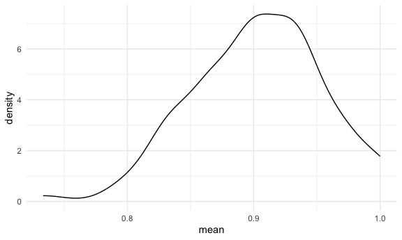

Simulation
================
Diana Hernandez
2023-11-02

Load key packages.

``` r
library(tidyverse)
```

    ## ── Attaching core tidyverse packages ──────────────────────── tidyverse 2.0.0 ──
    ## ✔ dplyr     1.1.3     ✔ readr     2.1.4
    ## ✔ forcats   1.0.0     ✔ stringr   1.5.0
    ## ✔ ggplot2   3.4.3     ✔ tibble    3.2.1
    ## ✔ lubridate 1.9.2     ✔ tidyr     1.3.0
    ## ✔ purrr     1.0.2     
    ## ── Conflicts ────────────────────────────────────────── tidyverse_conflicts() ──
    ## ✖ dplyr::filter() masks stats::filter()
    ## ✖ dplyr::lag()    masks stats::lag()
    ## ℹ Use the conflicted package (<http://conflicted.r-lib.org/>) to force all conflicts to become errors

``` r
library(rvest)
```

    ## 
    ## Attaching package: 'rvest'
    ## 
    ## The following object is masked from 'package:readr':
    ## 
    ##     guess_encoding

Set seed for reproducibility.

``` r
set.seed(12345)
```

Here’s an old function.

``` r
sim_mean_sd = function(n_obs, mu = 5, sigma = 1) {
  
  x_vec = rnorm(n = n_obs, mean = mu, sd = sigma)

  tibble(
    mean = mean(x_vec),
    sd = sd(x_vec)
  )
  
}
```

Let’s see what this does.

``` r
sim_mean_sd(n_obs=30)
```

    ## # A tibble: 1 × 2
    ##    mean    sd
    ##   <dbl> <dbl>
    ## 1  5.08 0.938

Let’s iterate to see how this works UNDER REPEATED SAMPLING!

``` r
output = vector("list", length = 100)

for (i in 1:100) {
  
  output[[i]] = sim_mean_sd(n_obs = 30)
}

sim_results = 
  bind_rows(output)

sim_results |>
  ggplot(aes(x = mean)) + geom_density()
```

<!-- -->

``` r
sim_results |>
  summarize(
    mu_hat = mean(mean),
    sd_hat = sd(mean)
  )
```

    ## # A tibble: 1 × 2
    ##   mu_hat sd_hat
    ##    <dbl>  <dbl>
    ## 1   5.00  0.180

Use a map function

``` r
sim_results_df = 
  expand_grid(
    sample_size = 30,
    iter = 1:100
  ) |> 
  mutate(
    estimate_df = map(sample_size, sim_mean_sd)
  ) |> 
  unnest(estimate_df)
```
